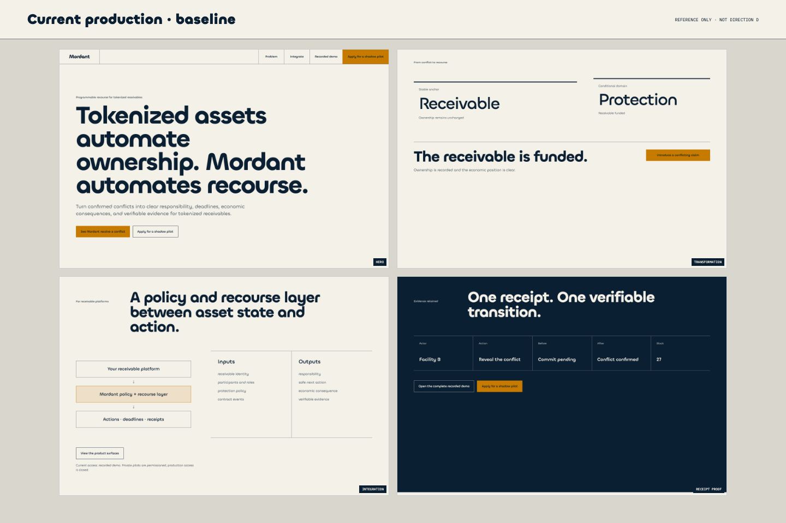
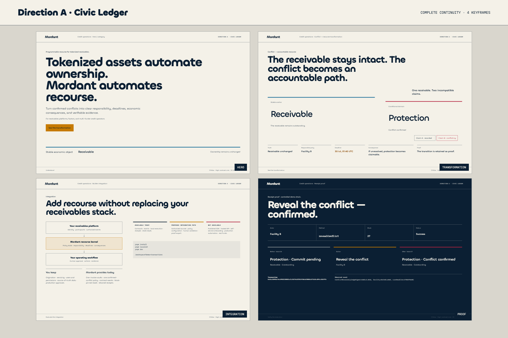
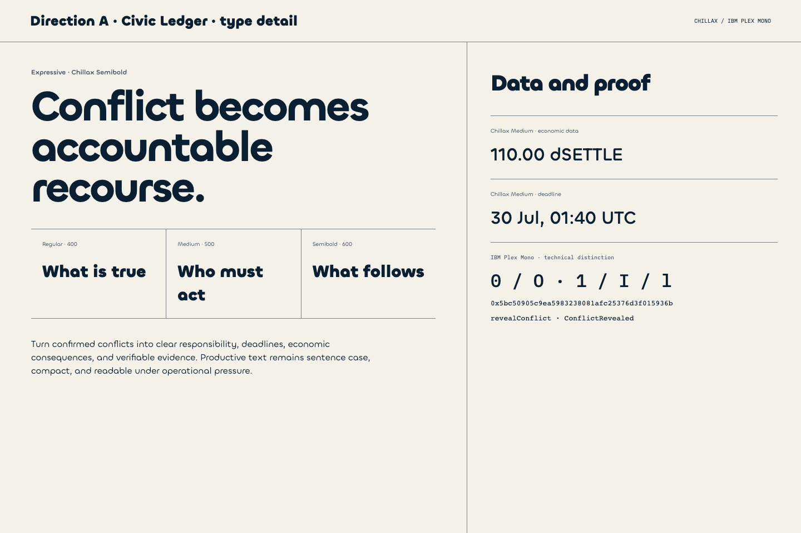
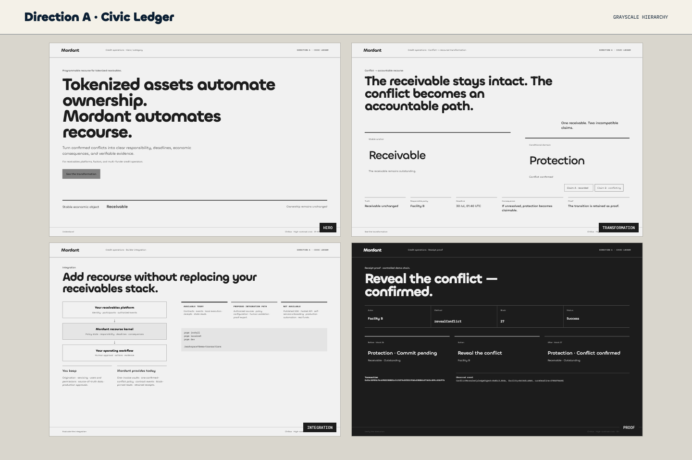
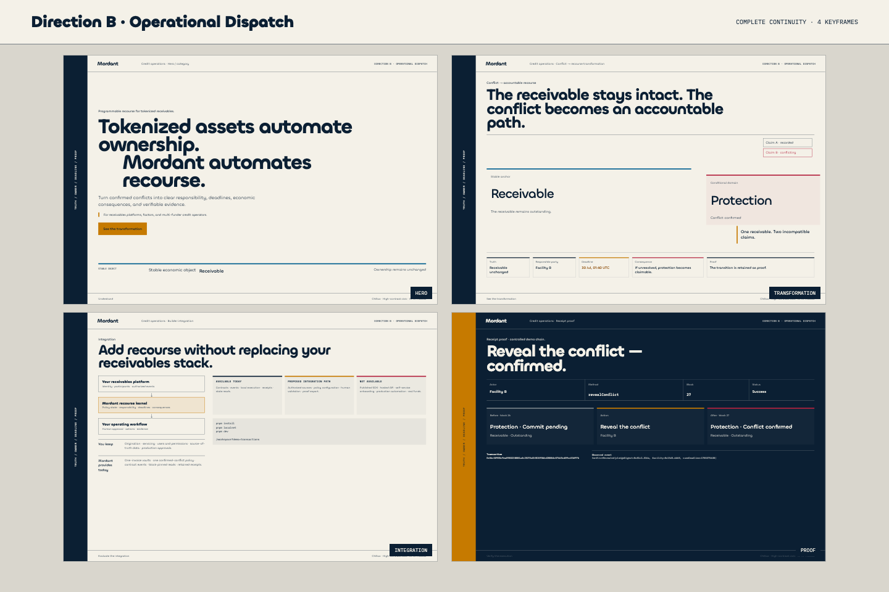
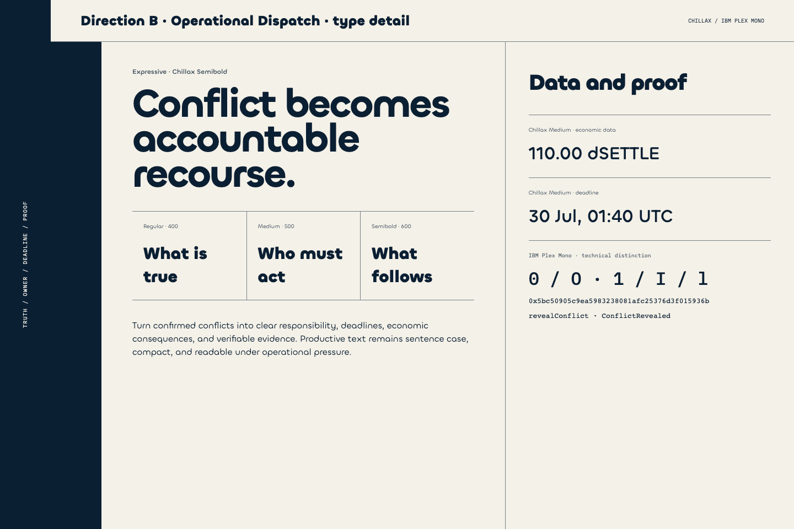
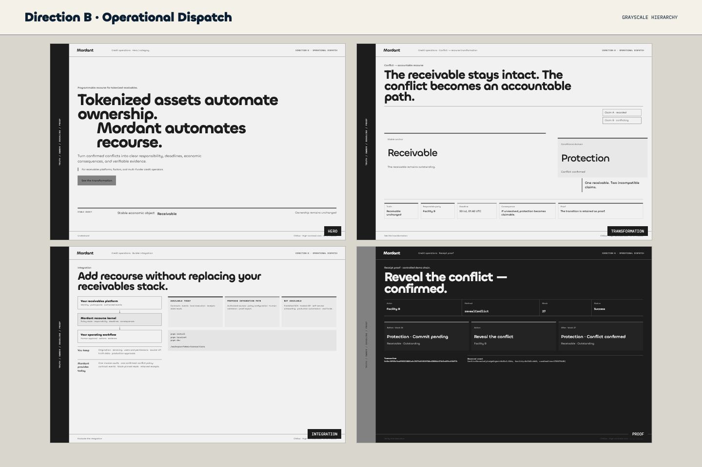
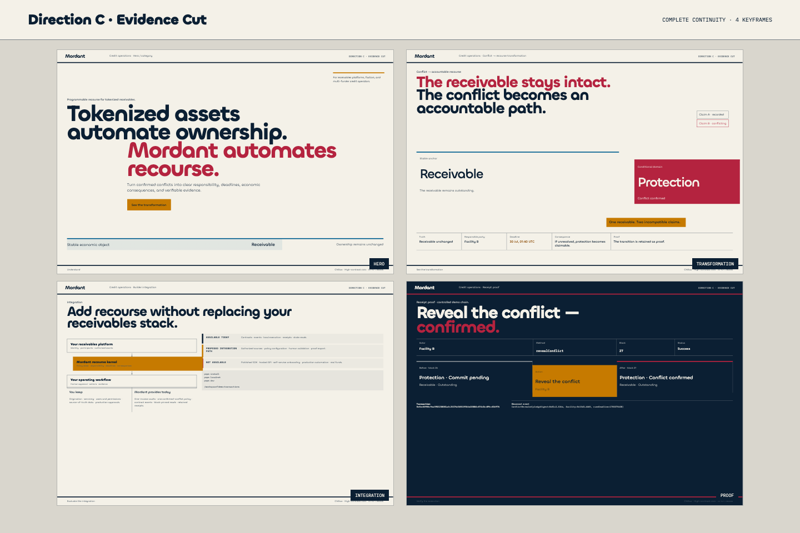
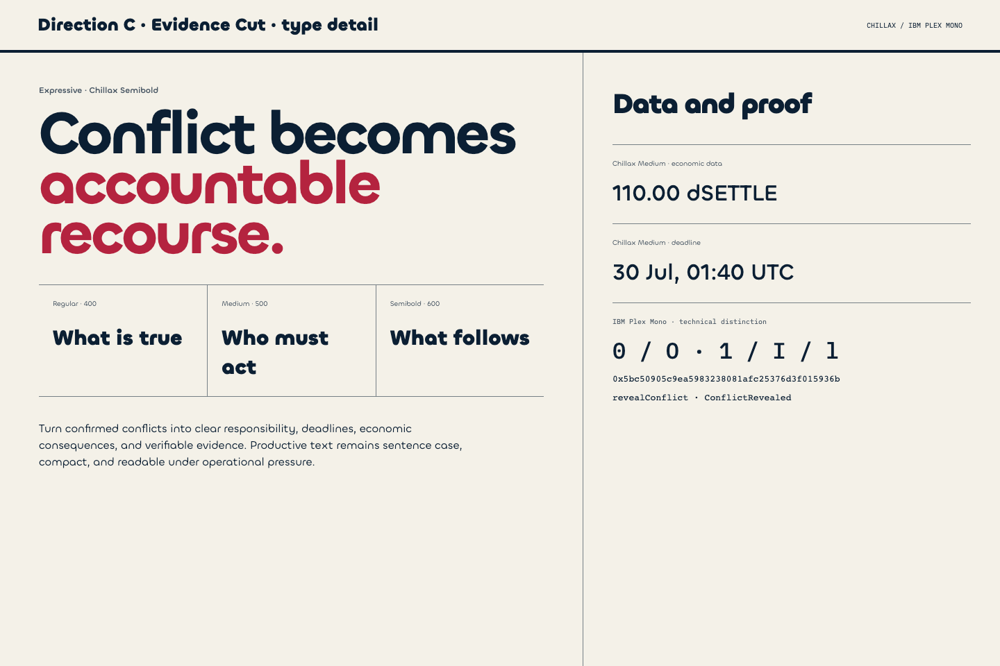
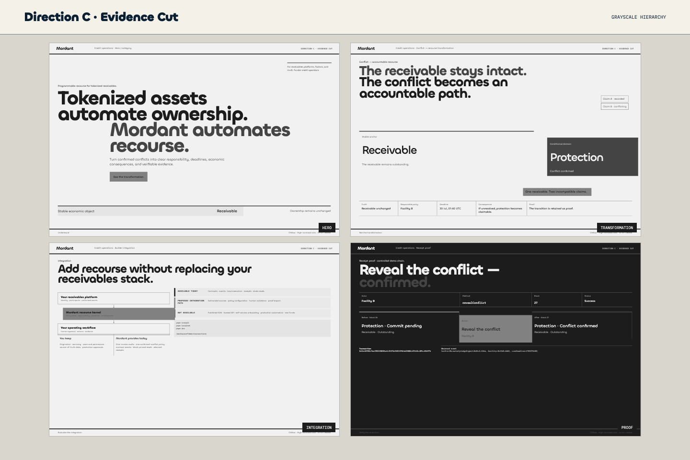

# M-KF1 — Coherent visual direction routes

Decision package only. These boards do not change production UI, routes, data, protocol behavior, typography, or the color-family roles.

The primary design protagonist is the credit / operations lead at a receivables platform or factor coordinating multiple financing parties. Every direction is tested against the same sequence and the same questions: what is true, who must act, before when, with what consequence, and with what proof.

## Fixed frame content

All three directions use the same four keyframes and the same product truth.

| Keyframe | Truth to understand | Stable element | Controlled rupture | Excluded |
| --- | --- | --- | --- | --- |
| Hero / category | “Tokenized assets automate ownership. Mordant automates recourse.” | Receivable as the stable economic object | The second proposition changes the rhythm, not the claim | Identifiers, blocks, receipts, test assets, internal state |
| Conflict → recourse | The receivable remains intact while a conflicting protection claim becomes responsibility, deadline, consequence, and proof | Receivable | Protection leaves alignment | Universal detection, legal priority, insurance, production-safety claims |
| Builder integration | Mordant is a policy and recourse layer; it does not replace the client platform or operating approvals | Client platform and operating workflow | Mordant kernel occupies the accountable boundary | Published SDK, hosted API, self-service onboarding, production automation, real funds |
| Receipt proof | A retained receipt proves one confirmed transition through actor, method, before, after, block, transaction, and event | Before/after state | The interface changes from warm paper to a dark evidence register | Marketing claims, invented results, proof detached from the recorded run |

The public integration truth remains explicit:

- **Available today:** contracts, interfaces, events, local execution, receipts, state reads, existing product surfaces.
- **Proposed integration path:** authorized sources, policy configuration, human validation, proof export, shadow pilot.
- **Not available:** published SDK, hosted API, self-service onboarding, production automation, real funds.

## Production baseline

The baseline is a reference, not a fourth direction. It records the current public production at the time of the study.

[Mobile baseline](assets/baseline-production-mobile.png)

## Direction A — Civic Ledger

The calmest route. It treats Mordant as a civic record: generous paper, long structural rules, restrained color, and one large conclusion. Narrative and interface remain clearly separated. The receipt is a quiet but decisive change of register.

Desktop: [Hero](assets/direction-a-hero-1440x960.png) · [Transformation](assets/direction-a-transformation-1440x960.png) · [Builder integration](assets/direction-a-integration-1440x960.png) · [Receipt proof](assets/direction-a-proof-1440x960.png)

Mobile: [Hero](assets/direction-a-hero-390x844.png) · [Transformation](assets/direction-a-transformation-390x844.png) · [Builder integration](assets/direction-a-integration-390x844.png) · [Receipt proof](assets/direction-a-proof-390x844.png)

## Direction B — Operational Dispatch

The protagonist-led route. A persistent operational rail gives the experience the cadence of a case file under pressure. It admits more real data, makes ownership/deadline/proof continuously legible, and lets `/developers` inherit the same system without turning the public story into a dashboard. Proof keeps the rail but changes its role from navigation to retained evidence.

Desktop: [Hero](assets/direction-b-hero-1440x960.png) · [Transformation](assets/direction-b-transformation-1440x960.png) · [Builder integration](assets/direction-b-integration-1440x960.png) · [Receipt proof](assets/direction-b-proof-1440x960.png)

Mobile: [Hero](assets/direction-b-hero-390x844.png) · [Transformation](assets/direction-b-transformation-390x844.png) · [Builder integration](assets/direction-b-integration-390x844.png) · [Receipt proof](assets/direction-b-proof-390x844.png)

## Direction C — Evidence Cut

The most assertive route. It uses typographic cuts, larger empty fields, harder grid breaks, and more concentrated color. The conditional protection domain becomes an unmistakable rupture; proof feels like the evidence left by that cut. It creates the strongest signature, but requires the most discipline to avoid editorial spectacle.

Desktop: [Hero](assets/direction-c-hero-1440x960.png) · [Transformation](assets/direction-c-transformation-1440x960.png) · [Builder integration](assets/direction-c-integration-1440x960.png) · [Receipt proof](assets/direction-c-proof-1440x960.png)

Mobile: [Hero](assets/direction-c-hero-390x844.png) · [Transformation](assets/direction-c-transformation-390x844.png) · [Builder integration](assets/direction-c-integration-390x844.png) · [Receipt proof](assets/direction-c-proof-390x844.png)

## Developer evaluation

Scores are comparative within this study, from 1 (weak) to 5 (strong). Difficulty and cost estimate only the four keyframes and their responsive implementation; they exclude backend and protocol work.

| Criterion | A — Civic Ledger | B — Operational Dispatch | C — Evidence Cut |
| --- | ---: | ---: | ---: |
| Understanding in five seconds | 5.0 | 4.5 | 4.0 |
| Mordant-specific personality | 3.5 | 4.5 | 5.0 |
| Credit / operations protagonist fit | 4.0 | 5.0 | 4.0 |
| Capacity for real data | 4.0 | 5.0 | 4.0 |
| Extension to `/developers` and product surfaces | 4.5 | 5.0 | 3.5 |
| Responsive difficulty | Low | Medium | High |
| Estimated implementation cost | 4–6 frontend days | 6–8 frontend days | 8–11 frontend days |
| Slop / marketing-drift risk | Low; generic-institutional drift is the real risk | Low; over-density is the real risk | Medium-high; editorial spectacle and crimson overuse |

Detailed rationale: [developer-evaluation.md](developer-evaluation.md).

## MY RECOMMENDATION

Direction B — Operational Dispatch.

## WHY

It is the only route whose organizing device directly mirrors the protagonist’s work: establish truth, owner, deadline, consequence, and proof under operational pressure. It is more distinctive than A without making color or expressive typography the product. It also gives `/developers`, Workspace, Participant, Protocol, and Proof a shared grammar that can accept real data at different densities.

## TRADE-OFFS BY DIRECTION

- **A — Civic Ledger:** fastest comprehension, strongest calm, lowest responsive cost. It risks looking like a refined version of the current baseline and may not carry enough operational personality.
- **B — Operational Dispatch:** strongest protagonist fit, data capacity, and product-system extensibility. Its rail and denser casework rhythm must disappear or compress cleanly on mobile, and density must remain audience-specific.
- **C — Evidence Cut:** strongest signature and clearest conditional rupture. It is the hardest to extend into data-heavy product surfaces and the easiest to drift toward campaign design or misuse crimson as decoration.

## OWNER DECISION REQUIRED

Select one coherent route: **Direction A, Direction B, or Direction C.** My recommendation is **Direction B**; no direction is selected or locked by this document.

## NEXT ACTION AFTER APPROVAL

Implement the selected route section by section, comparing each target board with a Playwright production capture and correcting visual deltas before moving to the next section.
