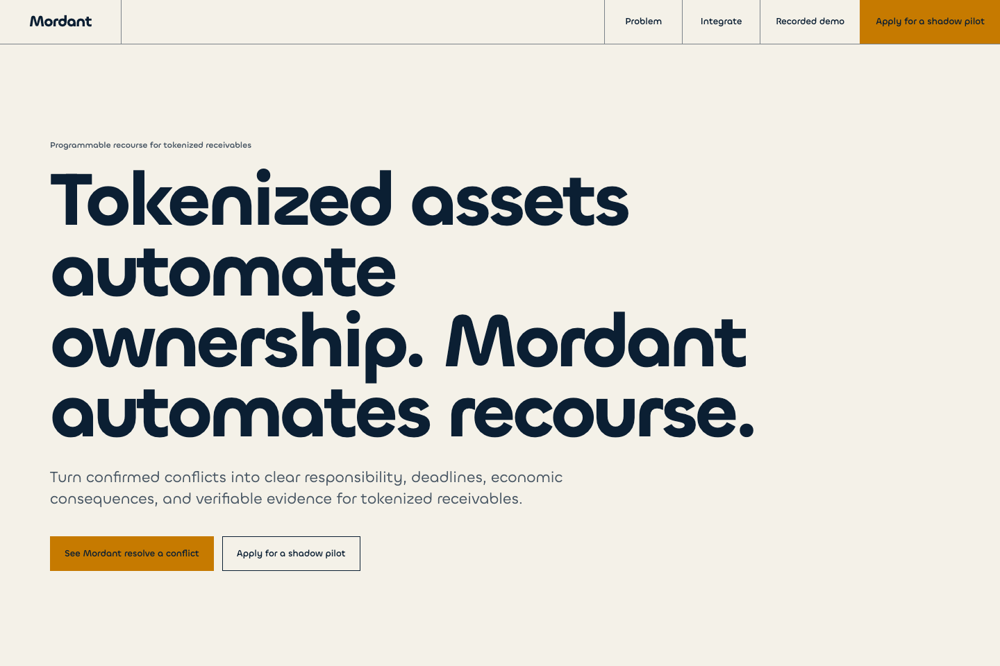
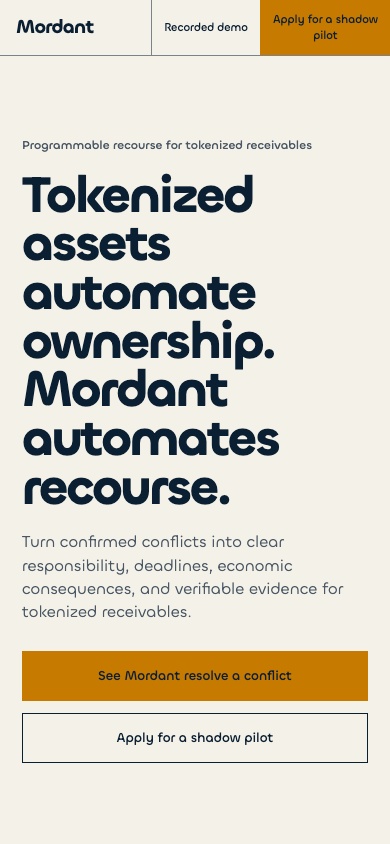
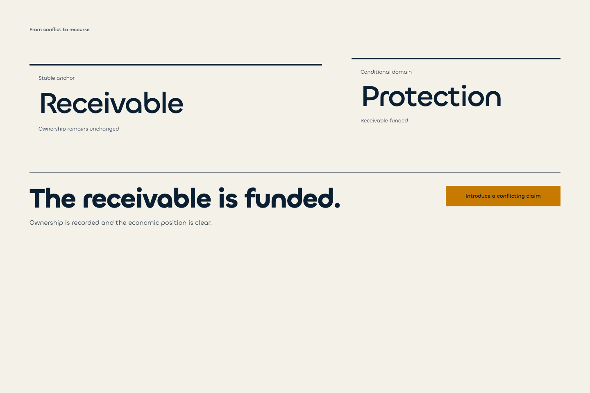
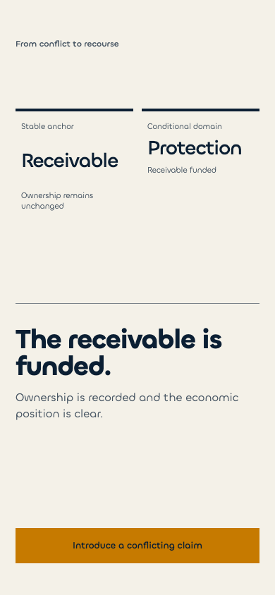
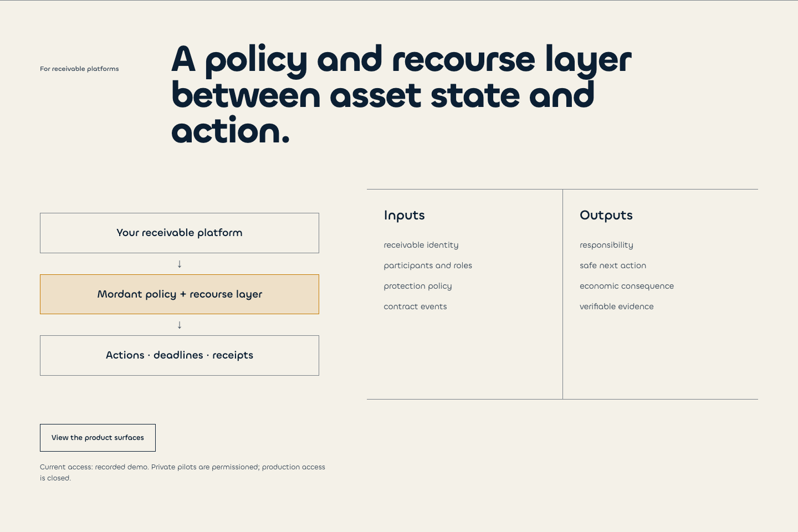
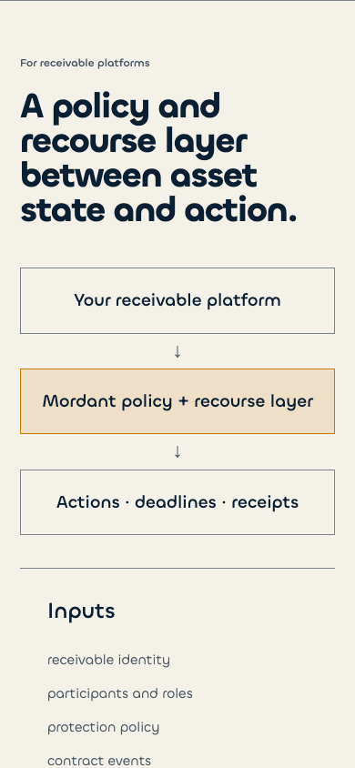
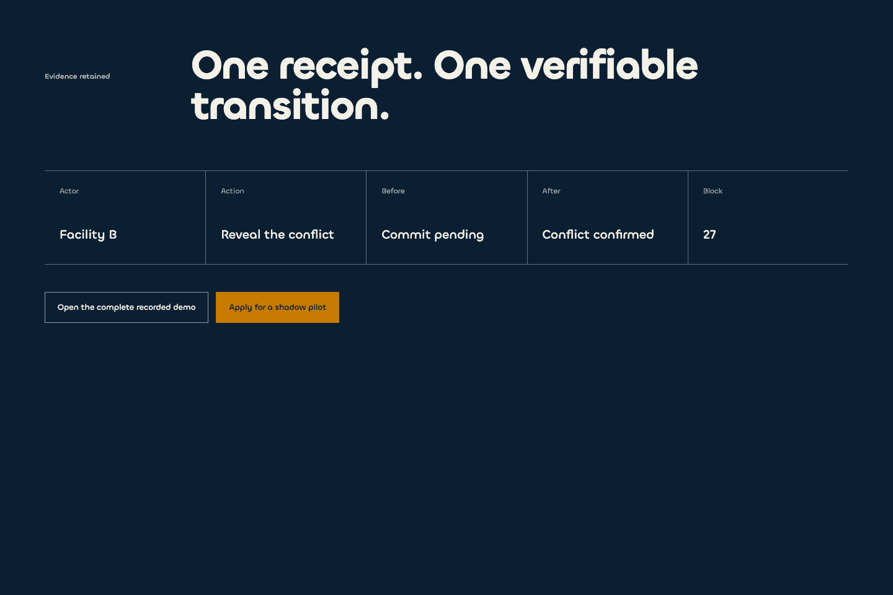
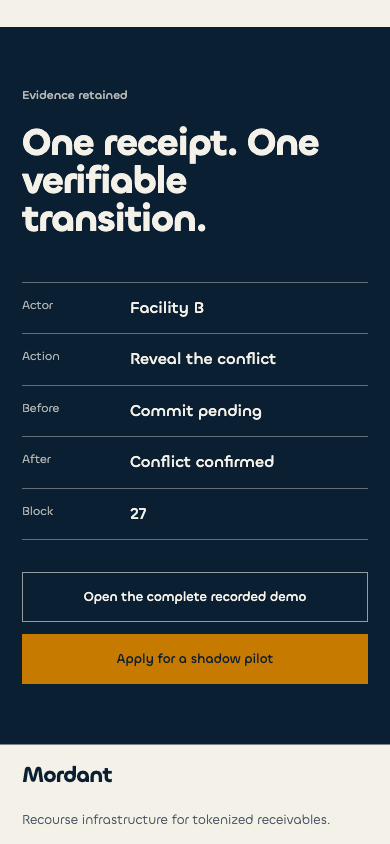

# Mordant — Designer unblock brief

## Purpose

We do not need another full landing-page proposal. We need one resolved visual idea for the first 2.5 viewports:

1. a calm category hero;
2. one signature conflict → recourse transformation;
3. the handoff from that transformation into receipt proof.

The current page already contains enough information. The design task is subtraction, hierarchy, and causal staging—not adding sections, icons, cards, labels, or explanatory copy.

## Current production state

Captured from `https://mordant-two.vercel.app/` on 30 July 2026 with reduced motion enabled.

Full page: [desktop](advisor-assets/current-home-desktop-full.png) · [mobile](advisor-assets/current-home-mobile-full.png)

### Hero

### Conflict transformation

### Integration

### Receipt proof

## Diagnosis

### What is working

- Chillax and the High-contrast civic palette already form a credible base.
- The warm-paper → dark-Proof register change is clear and specific.
- Receivable and Protection are understandable as two economic domains.
- The integration boundary is honest: client platform → Mordant layer → operating outputs.
- Mobile typography remains readable and the product does not depend on decorative imagery.

### What is blocking the experience

- The hero headline and supporting paragraph explain too much before the visitor sees the mechanism.
- The hero, transformation, value statements, integration, and Proof repeat the same semantic sequence at different levels of detail.
- The current transformation is a state selector, not yet a memorable causal demonstration.
- Receivable and Protection are presented as adjacent headings rather than one stable object and one displaced conditional domain.
- On mobile, the hero occupies nearly the full first viewport and the transformation needs another viewport before anything changes.
- A generated full-page composition tends to add generic process icons, numbered steps, feature bands, and explanatory copy. That makes the page more complete but less authored.

## Working visual route

Use **M-KF1 Direction B — Operational Dispatch** as the working system, not as a locked owner decision.

Its useful qualities are:

- operational precision;
- a case-file rhythm suited to the credit / operations lead;
- capacity for real data;
- continuity into `/developers` and product surfaces;
- hierarchy that remains credible without color.

Do not interpret Direction B as permission to make the public hero dense. Its operational grammar should appear in the causal object, not as dashboard chrome.

Reference: [Direction B continuity](assets/direction-b-continuity.png).

## Copy target

The current proposition is too long for the first viewport. Test this shorter hierarchy without adding an explanatory paragraph:

**Category**

`Recourse infrastructure for tokenized receivables`

**Hero**

`Turn conflict into accountable recourse.`

**Support**

`Know who must act, by when, and prove what changed.`

**Primary CTA**

`See the transformation`

**Secondary CTA**

`Evaluate the integration`

The shadow-pilot CTA belongs after proof, not in the hero.

## Signature object

Do not create an illustration beside the hero. Create one semantic object immediately after it.

### Fixed rules

- Receivable is a heavy horizontal lane and never moves.
- Protection begins aligned, then becomes the only displaced domain.
- A conflicting claim enters the same economic zone.
- Recourse is not another paragraph: the displacement resolves into responsible party, deadline, and consequence.
- The final checkpoint becomes the receipt; Proof replaces the light scene.
- Horizontal movement is the only dominant movement direction.
- No icon is required to explain any state.

### Four states

| State | Visible sentence | Essential facts | Visual event |
| --- | --- | --- | --- |
| Stable | `One receivable. One valid position.` | Receivable outstanding; protection aligned | No motion after entry |
| Conflict | `Two claims. One obligation.` | Conflicting protection claim | Protection leaves alignment; receivable stays fixed |
| Recourse | `Facility B must act by 30 Jul.` | Responsible party; deadline; consequence | Displaced path resolves into three operational facts |
| Proof | `Transition retained at block 27.` | Actor; action; before; after; block | Final node becomes receipt; dark register replaces scene |

Only one sentence is visible at a time. Content replaces content; it never accumulates below the scene.

## Page architecture after the signature

The target landing should contain only:

1. hero;
2. signature transformation;
3. integration boundary;
4. actual receipt proof;
5. shadow-pilot endcap.

Remove “The problem”, numbered “How it works”, and repeated “Operational value” bands as standalone sections. Their meaning is already carried by the hero and transformation.

The integration detail `Available today / Proposed integration path / Not available` remains important, but may live in a disclosure rather than competing with the primary diagram.

## Anti-slop constraints

- No numbered process row.
- No icon per outcome.
- No rounded feature cards.
- No illustration that repeats nearby copy.
- No background texture, gradient, glass, particles, or decorative lines.
- No different reveal animation for each section.
- No permanent ambient motion.
- No new section introduced to explain an existing section.
- No fake product data and no identifiers before Proof.

The handcrafted quality must come from optical alignment, line breaks, exact rule weights, real state values, controlled negative space, and one causal displacement.

## Motion boundary

One expressive motion sequence is allowed: Stable → Conflict → Recourse → Proof. Everything else uses short productive transitions. Carbon similarly distinguishes rare expressive moments from subtle productive motion used for routine interactions: [Carbon motion guidance](https://carbondesignsystem.com/elements/motion/overview/).

Reduced motion must expose the same four states without required spatial movement: [W3C animation from interactions](https://www.w3.org/WAI/WCAG22/Understanding/animation-from-interactions.html).

## Required designer output

Do not return another complete landing page.

Return one coherent proposal containing:

1. hero at 1440 × 960 and 390 × 844;
2. one four-state signature contact sheet at both sizes;
3. the light-scene → dark-Proof transition keyframe;
4. a removal map showing what disappears from the current page;
5. exact responsive behavior for the persistent control and text replacement;
6. a short assessment of whether Direction B should be selected as-is or rejected for one specific reason.

## Acceptance test

After five seconds, a visitor can say what Mordant does and for whom.

After fifteen seconds, the visitor can explain:

- what remained stable;
- what conflicted;
- who must act;
- when;
- what proof was retained.

The page must feel shorter after the work, not more complete through accumulation.

## Answer required from the advisor

Return one of two outcomes:

- `PROCEED WITH DIRECTION B + SIGNATURE SPEC`, with the resolved keyframes;
- `REJECT DIRECTION B`, with one concrete incompatibility and one coherent replacement route.

Do not return three new directions or independent options per section.
